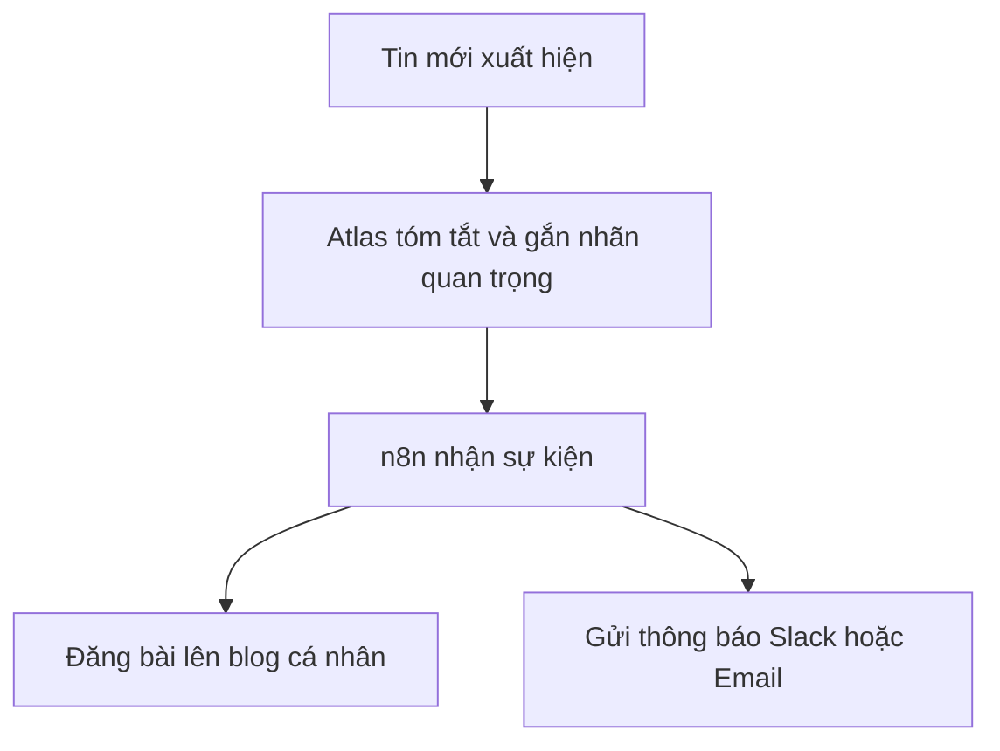

# ChatGPT Atlas là gì?

ChatGPT Atlas là nền tảng được phát triển dựa trên GPT-5, cho phép người dùng không chỉ trò chuyện mà còn **tự động hóa quy trình công việc** thông qua khả năng tích hợp với các hệ thống bên ngoài như Gmail, Notion, Slack hay n8n.

## 🧠 Tính năng nổi bật
- Kết nối trực tiếp với API, chạy tác vụ nền.
- Phân tích nội dung, tạo báo cáo, hoặc viết bài tự động.
- Tích hợp với n8n để tự động hóa luồng công việc (ví dụ: nếu có bài viết mới → gửi mail hoặc đăng lên website cá nhân).

## 🚀 Ứng dụng thực tế
- Theo dõi tin tức AI mới nhất và tự tóm tắt mỗi sáng.
- Quản lý email và phản hồi thông minh dựa trên ngữ cảnh.
- Viết, tóm tắt, và đăng bài Markdown tự động lên blog.

## 🔗 Kết hợp với n8n
Atlas có thể gửi kết quả phân tích sang n8n để thực thi hành động kế tiếp, ví dụ:

## ✨ Kết luận
ChatGPT Atlas không chỉ là công cụ hội thoại mà là **hệ thống AI hỗ trợ phát triển sản phẩm và tự động hóa toàn diện**, giúp nhà phát triển tiết kiệm thời gian và tăng năng suất.
